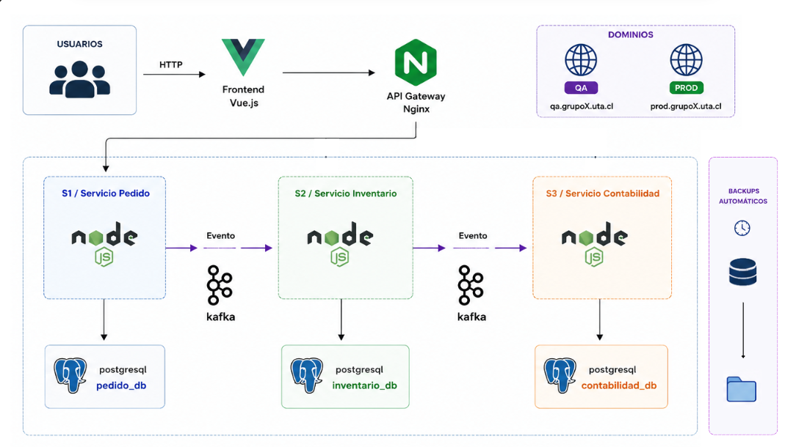
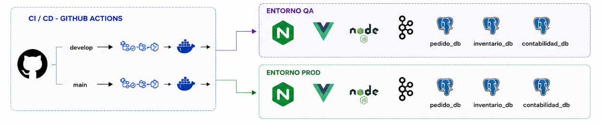

# Sistema de Monitoreo de Insumos Médicos

Plataforma distribuida para gestionar la trazabilidad, reserva y valorización de insumos médicos hospitalarios. El sistema implementa tres microservicios backend desacoplados que se coordinan de forma **asíncrona** mediante **Apache Kafka**, con persistencia independiente por servicio (PostgreSQL + Drizzle ORM), un **API Gateway** (NGINX) y un **Frontend** (Vue.js + Vite).

---

## 1. Diagrama Arquitectónico

Los usuarios acceden por HTTP al **Frontend (Vue.js)**, que enruta todas las llamadas `/api` a través del **API Gateway (NGINX)**. Detrás del gateway, los tres microservicios Node.js — **S1 Servicio Pedido**, **S2 Servicio Inventario** y **S3 Servicio Contabilidad** — se coordinan exclusivamente mediante eventos **Kafka** (S1 → evento → S2 → evento → S3), sin llamadas HTTP directas entre dominios. Cada servicio persiste en su propia base **PostgreSQL** (`pedidos_db`, `inventario_db`, `contabilidad_db`, patrón Database-per-Service), con **respaldos automáticos** hacia volúmenes persistentes dedicados. El sistema se publica bajo los dominios de **QA** y **PROD** (`qa.grupo5.uta.cl` / `prod.grupo5.uta.cl`).



**Secuencia del mensaje (happy path):**

1. El enfermero crea un pedido vía Frontend → API Gateway → **S1**.
2. **S1** persiste el pedido y publica `insumos.pedido.creado`.
3. **S2** consume el evento, reserva stock por cada ítem y publica un mensaje `insumos.reservado` por ítem.
4. **S1** actualiza el estado del pedido; **S3** acumula ítems hasta completar el pedido y emite la cuenta en `insumos.proceso.completado`.
5. **S1** marca el pedido como `COMPLETADO` y registra el costo total.

---

## 2. Contrato de Datos

Todos los mensajes Kafka comparten un **sobre (envelope)** común. El campo `datos` varía según el tópico. Las definiciones canónicas están en:

- `Servicio-Gestion-Pedido/src/modules/pedidos/pedidos.contracts.ts`
- `Servicio-Inventario/src/modules/inventario/inventario.contracts.ts`
- `Servicio-Contabilidad/src/modules/contabilidad/contabilidad.contracts.ts`

### 2.1 Tópicos Kafka

| Tópico | Productor | Consumidor(es) | Propósito |
|--------|-----------|----------------|-----------|
| `insumos.pedido.creado` | S1 — Gestión de Pedidos | S2 — Inventario | Notificar un nuevo pedido con sus ítems |
| `insumos.reservado` | S2 — Inventario | S1, S3 | Informar resultado de reserva por ítem |
| `insumos.proceso.completado` | S3 — Contabilidad | S1 | Entregar la cuenta médica emitida |

### 2.2 Envelope común (todos los tópicos)

```json
{
  "id_evento": "evt-pedidos-a1b2c3d4",
  "timestamp": "2026-07-20T18:30:00.000Z",
  "tipo_evento": "PEDIDO_CREADO",
  "origen_servicio": "servicio-pedidos",
  "datos": {}
}
```

| Campo | Tipo | Descripción |
|-------|------|-------------|
| `id_evento` | `string` | Identificador único del evento (`evt-pedidos-*`, `evt-inv-*`, `evt-cont-*`) |
| `timestamp` | `string` | Fecha ISO-8601 de emisión |
| `tipo_evento` | `string` | `PEDIDO_CREADO`, `STOCK_RESERVADO` o `CUENTA_EMITIDA` |
| `origen_servicio` | `string` | `servicio-pedidos`, `servicio-inventario` o `servicio-contabilidad` |
| `datos` | `object` | Payload específico del tópico (ver secciones 2.3–2.5) |

**Clave de partición Kafka:** siempre `pedido_id` (campo `key` del mensaje).

### 2.3 Tópico `insumos.pedido.creado`

**Productor:** S1 — **Consumidor:** S2

```json
{
  "id_evento": "evt-pedidos-a1b2c3d4",
  "timestamp": "2026-07-20T18:30:00.000Z",
  "tipo_evento": "PEDIDO_CREADO",
  "origen_servicio": "servicio-pedidos",
  "datos": {
    "pedido_id": "PED-20260720-ABC123",
    "nombre_enfermero": "María González",
    "pabellon": "Pabellón 3",
    "ficha_paciente": "FIC-998877",
    "items": [
      { "insumo": "Guantes quirúrgicos", "cantidad": 2 },
      { "insumo": "Jeringa 10ml", "cantidad": 5 }
    ]
  }
}
```

| Campo en `datos` | Tipo | Obligatorio | Descripción |
|------------------|------|-------------|-------------|
| `pedido_id` | `string` | Sí | Identificador del pedido (`PED-YYYYMMDD-XXXXXX`) |
| `nombre_enfermero` | `string` | Sí | Solicitante del pedido |
| `pabellon` | `string` | Sí | Ubicación clínica |
| `ficha_paciente` | `string` | No | Identificador del paciente |
| `items` | `array` | Sí (≥ 1) | Lista de insumos solicitados |
| `items[].insumo` | `string` | Sí | Nombre del insumo |
| `items[].cantidad` | `number` (entero > 0) | Sí | Unidades solicitadas |

### 2.4 Tópico `insumos.reservado`

**Productor:** S2 — **Consumidores:** S1 y S3 (un mensaje **por cada ítem** del pedido)

```json
{
  "id_evento": "evt-inv-e5f6g7h8",
  "timestamp": "2026-07-20T18:30:02.000Z",
  "tipo_evento": "STOCK_RESERVADO",
  "origen_servicio": "servicio-inventario",
  "datos": {
    "pedido_id": "PED-20260720-ABC123",
    "insumo": "Guantes quirúrgicos",
    "cantidad": 2,
    "estado_reserva": "RESERVADO",
    "unidades_reservadas": ["GQT-001", "GQT-002"],
    "disponibles": 2,
    "total_items": 2,
    "pabellon": "Pabellón 3",
    "ficha_paciente": "FIC-998877"
  }
}
```

| Campo en `datos` | Tipo | Obligatorio | Descripción |
|------------------|------|-------------|-------------|
| `pedido_id` | `string` | Sí | Pedido asociado |
| `insumo` | `string` | Sí | Ítem procesado |
| `cantidad` | `number` | Sí | Unidades solicitadas |
| `estado_reserva` | `"RESERVADO"` \| `"SIN_STOCK"` | Sí | Resultado de la reserva |
| `unidades_reservadas` | `string[]` | Sí | Seriales reservados (vacío si `SIN_STOCK`) |
| `disponibles` | `number` | Sí | Unidades disponibles al momento de la reserva |
| `total_items` | `number` | Sí | Cantidad total de ítems del pedido original |
| `pabellon` | `string` | Sí | Copiado del pedido |
| `ficha_paciente` | `string` | No | Copiado del pedido |

### 2.5 Tópico `insumos.proceso.completado`

**Productor:** S3 (solo cuando recibió todos los ítems del pedido) — **Consumidor:** S1

```json
{
  "id_evento": "evt-cont-i9j0k1l2",
  "timestamp": "2026-07-20T18:30:05.000Z",
  "tipo_evento": "CUENTA_EMITIDA",
  "origen_servicio": "servicio-contabilidad",
  "datos": {
    "cuenta_id": "CTB-2026-0001",
    "pedido_id": "PED-20260720-ABC123",
    "costo_total": 15750,
    "estado_pago": "PENDIENTE",
    "ficha_paciente": "FIC-998877",
    "items_facturados": [
      {
        "insumo": "Guantes quirúrgicos",
        "cantidad": 2,
        "precio_unitario": 2500,
        "subtotal": 5000
      },
      {
        "insumo": "Jeringa 10ml",
        "cantidad": 5,
        "precio_unitario": 2150,
        "subtotal": 10750
      }
    ]
  }
}
```

| Campo en `datos` | Tipo | Obligatorio | Descripción |
|------------------|------|-------------|-------------|
| `cuenta_id` | `string` | Sí | Folio contable (`CTB-AAAA-NNNN`) |
| `pedido_id` | `string` | Sí | Pedido facturado |
| `costo_total` | `number` | Sí | Suma de subtotales |
| `estado_pago` | `"PENDIENTE"` | Sí | Estado inicial de la cuenta |
| `ficha_paciente` | `string` | No | Referencia al paciente |
| `items_facturados` | `array` | Sí | Solo ítems con reserva `RESERVADO` |
| `items_facturados[].insumo` | `string` | Sí | Nombre del insumo |
| `items_facturados[].cantidad` | `number` | Sí | Cantidad facturada |
| `items_facturados[].precio_unitario` | `number` | Sí | Tarifa vigente |
| `items_facturados[].subtotal` | `number` | Sí | `precio_unitario × cantidad` |

---

## 3. Guía de Configuración de Acceso

El clúster Kubernetes expone la aplicación mediante **Ingress** con rutas virtuales bajo el dominio `.uta.cl`. Para que el evaluador resuelva esos nombres en su máquina local, debe editar el archivo **hosts**.

### 3.1 Dominios del proyecto

| Entorno | Host Ingress | Namespace K8s |
|---------|--------------|---------------|
| QA | `qa.grupo5.uta.cl` | `grupo5-qa` |
| Producción | `prod.grupo5.uta.cl` | `grupo5-prod` |

Tras el despliegue, el Ingress enruta:

- `/` → Frontend
- `/api` → API Gateway → microservicios

### 3.2 Obtener la IP del Ingress

Ejecute en la máquina donde corre el clúster:

```bash
kubectl get ingress insumos-ingress -n grupo5-qa
# o, para producción:
kubectl get ingress insumos-ingress -n grupo5-prod
```

Anote el valor de la columna **ADDRESS** (por ejemplo `127.0.0.1` con Docker Desktop, o la IP de Minikube / del balanceador del clúster).

> **Desarrollo local con Docker Compose** no requiere modificar `hosts`: la app queda en `http://localhost` (puerto 80 del gateway). Los dominios `.uta.cl` aplican al despliegue en Kubernetes.

### 3.3 Windows

1. Abrir **Bloc de notas como Administrador**.
2. Abrir el archivo:
   ```
   C:\Windows\System32\drivers\etc\hosts
   ```
3. Agregar al final (reemplace `<IP_INGRESS>` por la IP obtenida en 3.2):

   ```
   <IP_INGRESS>   qa.grupo5.uta.cl
   <IP_INGRESS>   prod.grupo5.uta.cl
   ```

4. Guardar el archivo.
5. Limpiar caché DNS (PowerShell como Administrador):

   ```powershell
   ipconfig /flushdns
   ```

6. Verificar resolución:

   ```powershell
   ping qa.grupo5.uta.cl
   ```

### 3.4 Linux / macOS

1. Editar hosts con privilegios de administrador:

   ```bash
   sudo nano /etc/hosts
   ```

2. Agregar las mismas líneas:

   ```
   <IP_INGRESS>   qa.grupo5.uta.cl
   <IP_INGRESS>   prod.grupo5.uta.cl
   ```

3. Guardar (`Ctrl+O`, `Enter`, `Ctrl+X` en nano).
4. Verificar:

   ```bash
   ping -c 3 qa.grupo5.uta.cl
   curl -I http://qa.grupo5.uta.cl/
   ```

---

## 4. Manual Operativo de Control

Comandos unificados para revisar el estado del sistema y **certificar que los respaldos persisten** en volúmenes dedicados. Ejecutar desde la raíz del repositorio.

### 4.1 Estado general del sistema

#### Entorno local (Docker Compose)

```bash
# Variables de entorno
cp .env.example .env   # editar POSTGRES_PASSWORD y PGADMIN_DEFAULT_PASSWORD

# Levantar toda la infraestructura
docker compose up -d --build

# Estado de contenedores
docker compose ps

# Salud de Kafka, servicios y bases de datos
docker compose ps --format "table {{.Name}}\t{{.Status}}\t{{.Ports}}"
```

| Servicio | URL / Puerto local |
|----------|-------------------|
| Frontend | http://localhost:3000 |
| API Gateway | http://localhost (puerto 80) |
| Kafka UI | http://localhost:8080 |
| pgAdmin | http://localhost:5050 |

#### Entorno Kubernetes (QA / Producción)

```bash
# Verificación inicial de herramientas y clúster
bash scripts/setup-local.sh

# Despliegue
bash scripts/deploy-qa.sh          # namespace grupo5-qa
bash scripts/deploy-production.sh  # namespace grupo5-prod

# Estado unificado (namespaces, pods y services)
bash scripts/status.sh

# Detalle por namespace
kubectl get all -n grupo5-qa
kubectl get ingress -n grupo5-qa
kubectl rollout status deployment/servicio-gestion-pedido -n grupo5-qa
```

#### Logs de aplicación

```bash
# Local
docker compose logs -f servicio-gestion-pedido servicio-inventario servicio-contabilidad

# Kubernetes (QA)
bash scripts/logs.sh
kubectl logs deployment/servicio-inventario -n grupo5-qa --tail=100
kubectl logs deployment/servicio-contabilidad -n grupo5-prod --tail=100
```

#### Operaciones de mantenimiento (Kubernetes)

```bash
bash scripts/restart-qa.sh           # reinicia apps sin tocar BDs ni Kafka
bash scripts/restart-production.sh   # equivalente en prod
bash scripts/rollback.sh             # revierte despliegue de pedidos en QA
bash scripts/destroy.sh              # elimina el overlay QA completo
```

### 4.2 Verificación de respaldos persistentes

Los respaldos se generan **cada 10 minutos** y se almacenan en volúmenes persistentes independientes por base de datos.

#### Local — Docker Compose

Contenedores: `respaldo-pedidos`, `respaldo-inventario`, `respaldo-contabilidad`.  
Volúmenes: `backups_pedidos`, `backups_inventario`, `backups_contabilidad`.

```bash
# Confirmar que los sidecars de respaldo están activos
docker compose ps respaldo-pedidos respaldo-inventario respaldo-contabilidad

# Listar archivos .sql.gz dentro de cada volumen persistente
docker exec respaldo-pedidos      ls -lah /backups
docker exec respaldo-inventario   ls -lah /backups
docker exec respaldo-contabilidad ls -lah /backups

# Inspeccionar volúmenes Docker (prueba de persistencia)
docker volume inspect proyecto-insumos-m-dicos_backups_pedidos
docker volume inspect proyecto-insumos-m-dicos_backups_inventario
docker volume inspect proyecto-insumos-m-dicos_backups_contabilidad

# Ver último respaldo generado (ejemplo pedidos)
docker exec respaldo-pedidos sh -c "ls -1t /backups/*.sql.gz 2>/dev/null | head -1 | xargs -I{} sh -c 'echo Archivo: {}; ls -lh {}'"
```

**Criterio de aceptación:** debe existir al menos un archivo `*.sql.gz` reciente en `/backups` de cada contenedor de respaldo, y los volúmenes deben reportar `"Mountpoint"` con datos persistentes fuera del contenedor.

#### Kubernetes — CronJobs + PVC

Manifiestos en `k8s/base/backups.yaml`. PVCs: `respaldos-pedidos-pvc`, `respaldos-inventario-pvc`, `respaldos-contabilidad-pvc`.

```bash
# CronJobs y jobs recientes de respaldo
kubectl get cronjobs -n grupo5-qa
kubectl get jobs -n grupo5-qa | grep respaldo

# PVCs vinculados (estado Bound = volumen persistente asignado)
kubectl get pvc -n grupo5-qa | grep respaldos

# Logs del último job de respaldo (reemplazar <job-name>)
kubectl logs job/<job-name> -n grupo5-qa

# Listar archivos dentro del PVC de pedidos (pod temporal de verificación)
kubectl run verificar-respaldo-pedidos --rm -it --restart=Never \
  -n grupo5-qa \
  --image=busybox:1.36 \
  --overrides='{"spec":{"containers":[{"name":"verificar-respaldo-pedidos","image":"busybox:1.36","command":["sh","-c","ls -lah /respaldos && du -sh /respaldos"],"volumeMounts":[{"name":"respaldos","mountPath":"/respaldos"}]}],"volumes":[{"name":"respaldos","persistentVolumeClaim":{"claimName":"respaldos-pedidos-pvc"}}]}}'
```

Repita el comando anterior cambiando el PVC a `respaldos-inventario-pvc` o `respaldos-contabilidad-pvc` para certificar las otras bases.

**Criterio de aceptación:** los CronJobs `respaldo-pedidos`, `respaldo-inventario` y `respaldo-contabilidad` deben mostrar ejecuciones exitosas; los PVC deben estar en estado `Bound`; dentro de `/respaldos` deben existir archivos `pedidos_*.sql.gz`, `inventario_*.sql.gz` y `contabilidad_*.sql.gz`.

### 4.3 Monitoreo del bus de eventos

```bash
# Local — consola web de Kafka
# Abrir http://localhost:8080 y revisar los tópicos:
# insumos.pedido.creado | insumos.reservado | insumos.proceso.completado

# Local — listar tópicos desde CLI
docker exec kafka /opt/kafka/bin/kafka-topics.sh \
  --bootstrap-server localhost:9092 --list
```

---

## 5. CI/CD — GitHub Actions

Cada componente (Frontend, API Gateway y los 3 microservicios) tiene su propio pipeline en `.github/workflows/`. El flujo es idéntico para todos y está gobernado por la rama de origen: un push a **`develop`** construye/testea, publica la imagen Docker en **ghcr.io** y despliega al **entorno QA** (`grupo5-qa`); un push a **`main`** ejecuta el mismo pipeline hacia el **entorno PROD** (`grupo5-prod`). Ambos entornos ejecutan el stack completo: NGINX, Vue.js, los servicios Node.js, Kafka y las tres bases PostgreSQL (`pedidos_db`, `inventario_db`, `contabilidad_db`).



Etapas de cada pipeline:

1. **Build & Test** — compila el componente (omitido en API Gateway, que es NGINX + configuración estática).
2. **Build & Push Docker** — construye la imagen y la publica en `ghcr.io/<repo>/<componente>` con tags `qa-latest`/`prod-latest` y `<env>-<sha>`.
3. **Deploy** — `kubectl set image` sobre el Deployment correspondiente en el namespace del entorno, con verificación de rollout.

---

## Referencia del repositorio

| Ruta | Contenido |
|------|-----------|
| `Servicio-Gestion-Pedido/` | S1 — ciclo de vida de pedidos y consumo de eventos finales |
| `Servicio-Inventario/` | S2 — reserva de stock físico |
| `Servicio-Contabilidad/` | S3 — emisión de cuentas médicas |
| `Api-gateway/` | NGINX — proxy inverso |
| `Frontend/` | SPA Vue.js |
| `k8s/` | Manifiestos Kubernetes (Kustomize: `base`, `overlays/qa`, `overlays/prod`) |
| `scripts/` | Automatización de despliegue, estado, logs y rollback |
| `docker-compose.yml` | Stack completo para desarrollo local |

**Stack tecnológico:** Node.js + TypeScript, Drizzle ORM, PostgreSQL 16/17 (16-alpine en Docker Compose y en la BD de pedidos en K8s; 17-alpine en las BDs de inventario y contabilidad en K8s), Apache Kafka 3.8, NGINX, Vue.js 3, GitHub Actions (CI/CD). Gestión de dependencias por componente: **npm** en `Frontend/` y **pnpm** en los tres microservicios (cada servicio con su propio lockfile; no existe un workspace pnpm a nivel de raíz).
